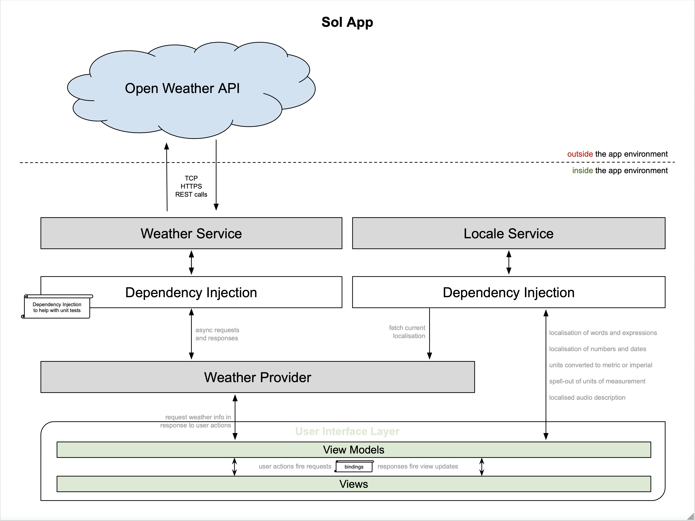

# Sol App

Sol is a weather forecast app. The app uses [openweathermap.org](https://openweathermap.org) as the data source. _Sol_ initially displays the weather for the current location, as well as the forecast for the next three days, by three-hour steps. The user can choose a different location by browsing the big map in the middle of the screen. The user can optionally see more information or listen to the weather report, by accessing the info view at the bottom.

## _System design_

## _Features_
### Main Features
- Retrieve weather and forecast for the current location
- Browse through the fetched data
- See extended information
- Change current location by browsing the map
- App supports localisation, based on the system preferences. There are five locales available:
    - en - shows app in imperial units
    - en-GB - shows app in metric units, fallback locale
    - es - latin language with diacritics
    - pt - latin language with diacritics, also because I am Brazilian :)
    - he - shows app supporting right-to-left culture

### Cool Features
- App respects the device light/dark theme
- Audio description, potentially being used as an accessibility resource
- Reveals the extra info card with drag gesture and animation
- Debounced loading indicator, which is only shown when the request takes more than 1 second to respond.

### Wish list
Features not implemented due to lack of time to improve the app
- Animated transition on browsing forecast periods
- When revealing or hiding the extra info card, use fine-tuned, more natural spring animation instead of non-natural ease-out
- Hazardous weather report area, possibly with push notifications
- A better error handling view. Currently it is a simple system Alert.

## _Decisions Taken & Assumed Compromises_
The app picks out the current user location as the initial place for weather data source. The app has to rely on the user consent to retrieve the current location. In case the user does not consent, it falls back to London, GB.

A map was chosen as the means of navigation to places. It is a good native feature, that has built-in user-friendly gestures like pinching to zoom in and out, dragging to move inside the map. However, while the user is browsing the map, it causes many "current location" changes per second. It doesn't make sense to call the weather API so frequently. After all, making network requests are expensive in many senses: it consumes system resources, network bandwidth, and the service API charges usage fees. Therefore, a debounce of 1 second is applied. That is, the weather is only retrieved after one second after the user has the map steady.

The weather API delivers the data in many languages, including the five chosen locales included in this app. The app retrieves the weather information in the system-chosen language.

The weather API delivers the data in three unit systems: api-default, metric and imperial. The app rather fetches the data in the api-default and converts the units locally, according to the unit system selected in the user's system preferences. There is no app-specific reason for the choice. The reason is to simulate a decision of the development team, to split the power of processing between the server and the client. After all, if it is chosen to use conversions on the server, the server would have to convert the data for all requests, which takes a lot of server processing time. But if it is chosen to use conversions on the client, the client would have to convert only its own request. Also as a secondary reason, this implementation allows the developer to show off some logic skills, instead of simply consuming information that is ready for use.
